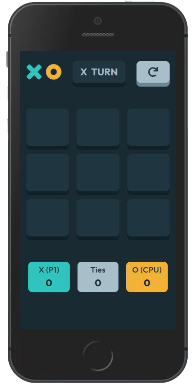
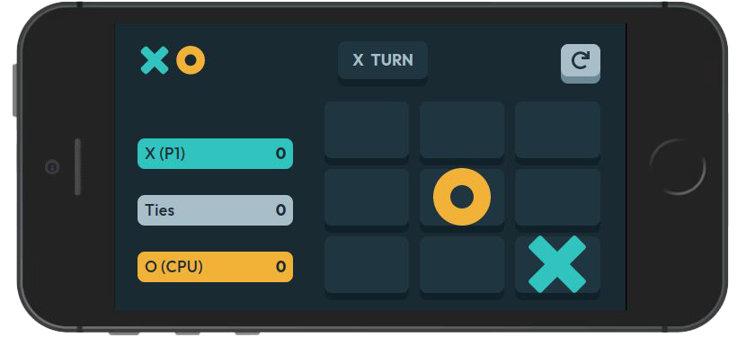

# Tic Tac Toe V2

<div style="display: flex">


</div>

<br>
<br>

A React-based, fully responsive, Tic Tac Toe game that features two modes - Player vs CPU & Player vs Player.

This project was a lovely opportunity to follow a structured Figma design and bring to life. For the CPU part, I implemented the minimax algorithm, to create an unbeatable AI.

Structure-wise, it is based on JavaScript, TailwindCSS, Emotion and Redux Toolkit. For a detailed overview, please have a look at the [**Features**](#features) & [**Tech**](#tech) section.

**Important Note**: All of the image assets, along with the design files were provided by Frontend Mentor, as part of the _Tic Tac Toe game_ challenge.

<br>

## Installation

As this project was bootstrapped with React, the following scripts are available:

**Install** the dependencies:

```
npm install
```

Run the app in **development** mode:

```
npm start
```

Launch the **test server** in the interactive watch mode:

```
npm test
```

## <a id='features'></a>Features

- Minimax algorithm for the CPU.
- Dynamic icon states.
- Dynamic colors for winning coordinates.
- Fully-responsive in both landscape & portrait mode.

## <a id='tech'></a>Tech

- React
- JavaScript
- TailwindCSS
- Emotion
- UUID
- Prop types

For a more detailed overview of the development & production dependencies, please check `package.json`.

## Live Version

<https://developedbygeo.github.io/Tic-tac-toe-v2/>

## Contributions

Contributions are certainly welcome. Please feel free to open an issue/PR if there is something you would like to be changed.

## Acknowledgements

A massive thank you to The Odin Project, freeCodeCamp & Frontend Mentor for their guidance and quality material.

## License

[MIT](./LICENSE.md)
